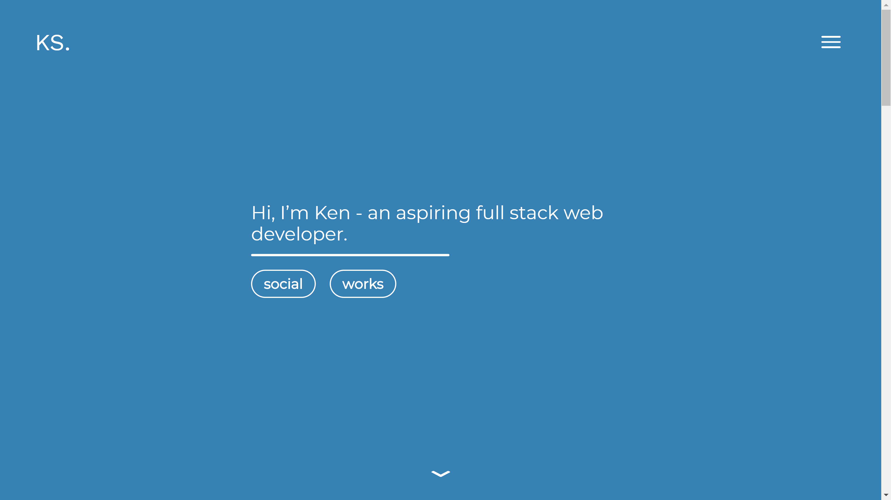
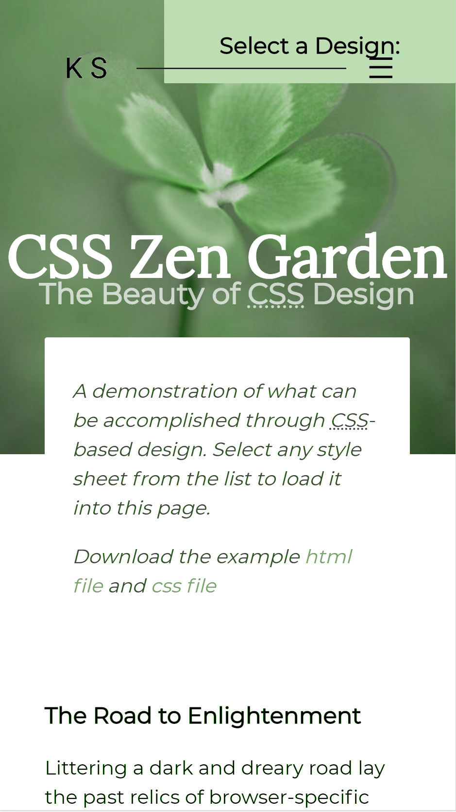

[Published Portfolio website](https://kenshufr.github.io/)\
[Portfolio assessment backup Github repo](https://github.com/kenshufr/portfolio-assessment)\
[Portfolio website repo](https://github.com/kenshufr/kenshufr.github.io)\

##Purpose
The purpose of my website is to host and showcase in an interesting way to those interested my previous works, as well as being centralised hub for anything to do with me and social media.

##Functionality/features
I decided to make my project a one-page website, with the information on there being specifically curated into responsive, full-screen pieces. Users can navigate via scrolling, the hamburger menu or the downward chevron to explore the site. There are plentiful links on there to guide the user to whatever else they may be interested in eg. github code or social media pages.

There is minimal animation happening on the pages, as I prioritised a 60fps and low gpu impact experience, but just enough to improve the aesthetic of the site.

##Sitemap
The website is all on one page. Any other links redirect to other websites.

##Screenshots

##Target audience
Potential employers, future clients, and once I start blogging and what not also hopefully peers and aspiring web developers.

##Tech stack
The website is built on a tech stack which includes HTML5 to create the content, Sass- a CSS3 precompiler to stylise the web page and a smidgen of jQuery for snap-scrolling and directing animation when elements are visible in the viewport. Git is also used for version control and the website is hosted on Github.

#Design documentation

##Design process
Given the longer timeframe of this assessment, I went ahead and read the UI/UX book Don't Make Me Think as recommended by Bianca before starting anything. 

I did not view many other portfolios online, but I have listed a few that I admired:
[Principal design agency](http://www.principals.com.au/)\
[Tinyhunter design agency](https://tinyhunter.com.au/)\
[Adham- web developer](www.adhamdannaway.com/)\
[Awwwards minimal sites](https://www.awwwards.com/websites/minimal/)

While browsing through other web developer portfolios online, I personally felt 3 pain points:
 - websites that were hard to find all the information you needed
 - technically impressive sites with long load times and input delay due to heavy performance load
 - walls of hard-to-read text

I therefore chose to make the portfolio website to be as intuitive as possible while minimising frustration by having a clearly defined website flow. My inexperience with CSS/js in general had a part to play in choosing to make a simpler, clean site.

Afterwards, I used Workflowy to make an initial plan of my website and broke the process into small chunks of work.

I then used Figma to create wireframes of the mobile version of the website, which went through multiple iterations due to technical restraints and design changes.

Due to the minimal text that is actually in place, using multiple font styles early on eg Lato / Work Sans felt abit jarring, so I ended up using Montserrat uniformly throughout the website.

Taking a page from early apple/google ads, I opted for full-sized, soft color or greyscale backgrounds, with each page conveying a slightly different colour scheme.

CSS animations, mostly translateY/translate3D were used.

jQuery was used pretty much as a necessity, as it turns out CSS snap-scrolling it not yet available for mobiles... which I found out way too late into the project. As an extension, although I had created my own animations, I had to convert to animate.css and aniview jQuery plugin to make sure the entrance animation only played once that page was visible.

##Wireframes

##Usability considerations
All media comes with alternate titles and font-size is easily scaled, which assists those using a screenreader.
Page download sizes are small, and animations are miniimal which benefit those with slower connections.

##Project plan/timeline
Tuesday: 
- started Don't Make Me Think
- browsed for inspiration online
Wednesday:
- finished Don't Make Me Think
- completed landing page wireframe

Unfortunately, I came down with a cold on Thursday, and for the next day I just messed around with GIMP(image editor), CSS canvas animations and some jQuery. None of my experiments ended up in my final website just as a usability concern, but seeing as how my target audience would be on the more tech-savvy side of the spectrum, I may add them back in.

The HTML/CSS portion was mostly finalised by Saturday, and the documentation was finished on Sunday.

##Trello

#Q&A
###Describe key events in the development of the internet from the 1980s to today.

1980 - Tim Berners-Lee builds ENQUIRE, an early hypertext-using software model in which textual data can be shared and presented between devices in a network

1989 - Tim Berners-Lee authors a proposal for "a large hypertext database with typed links", in which he coins the term 'world wide web'
1990 - Time Berners-Lee finalises HTTP v0.9 and HTML, as well as the world's first HTTP server and web browser 

1992 - Erwise, the world's first cross-platform web browser by Pei-Yuan Wei is tested successfully

1993 - Mosaic, later known as Netscape, is released and popularises the web as it was a gui web browser

1994 - World Wide Web Consortium (W3C) is established by Tim-Berners-Lee with MIT, DARPA and the EC to maintain internet standards

1998 - Google is formed in US, and creates the world's most popular search engine

1999 - Napster, the music file-sharing program is created, sparking discussions of internet piracy

1999 - Rapid commercialisation of the internet culminates in the dot-com bubble

2001 - Internet affordability is widely observed, mainly due to overcapacity as a result of the dot-com bust.

2002 and beyong - Rise of user-created content in the form of blogs, Youtube, Wikipedia etc. is coined as the Web 2.0

2008 - HTML5 is released to the public, resulting in much more appealing web interfaces

2014 - Mobile internet usage exceeds Desktop internet usage per capita

###Define and describes the relationship between fundamental aspects of the internet such as: domains, web servers, DNS, and web browsers.

All media, webpages and data that we interact with on the internet is stored in servers.
Hosts, or hosting providers, maintain these servers and charge a fee to website owners for their use.
Each website has a domain name, stored on DNSs (domain name service) with that ISP/host.
All servers, PCs and other devices have an IP address to locate them over the internet in the form of xxx.xxx.xxx.xxx 
When you type in a domain name over the internet, it checks the DNS for the equivalent IP address, and the request is sent to that hosting provider. The hosting provider will then relay back the site data through many other servers to your device.
All data is relayed over the internet in the form of packets - self-contained packages containing info on :
- what kind of data it is holding
- how the data pieces together with other packets
- origin of the data
- destination of the data

Networks intersect at junctions containing routers which send packets to other networks. If the packet is not travelling to a network known to the router it will be sent to a predefined gateway which connects dissimilar networks.
Mail servers differ in both hardware and software as it is a legacy system with very specific requirements. 
Simple mail transfer protocol - SMTP - is used to transfer data from clients to servers and between servers
Post office protocol - POP - is used to retrieve mail from a remote server for the client
URLs contain the web address for the web page. 
Domains are registered for a set period of time after being bought(rented) from a domain name registrar.
Domain registries are organisations that index all domains - registrars sometimes also provide hosting and pays registries to register domain renting.

###Reflect on one aspect of the development of internet technologies and how it has contributed to the world today.

Accessibility.

As a form of communication with unprecedented speed and coverage, one of the key social impacts that the internet has had on our society is the near instantaneous sharing and retrieval of knowledge available. As of 2018, a user is spoiled for choices on any topic matter they wish to look up. Search engines index a large majority of the visible web, and acquiring the information needed to master a new skill or industry has almost no barrier. 

The lack of impediments to free speech and information broadcasting has its own downsides as well. There is so much content, most of it unvetted, that it is up to the user to apply critical thought to evaluate that information. The rise of cybersectarianism as a proponent for segmentation and radicalisation has demonstrated how the internet can also propagate malicious information. A recent example of  misinformation is the rise of 'fake news' and divisive propaganda and its effectiveness at influencing real world politics.

Overall, the internet's contribution to society is overwhelmingly positive. As of 2018, over 4 billion of the world's population uses the internet directly, aiding in both education and collaboration.